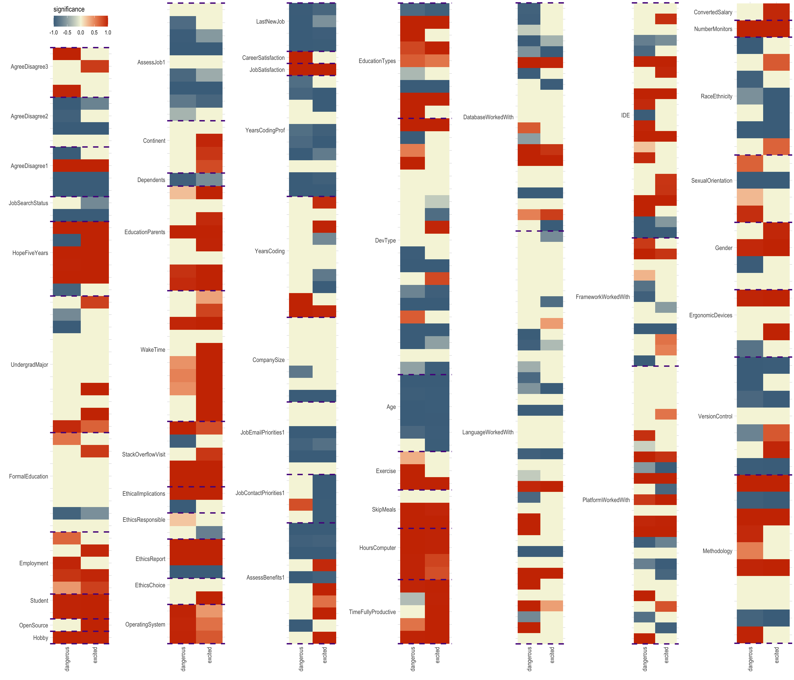

## 1. Introduction

Even though the term “AI” has become a trending topic that attracts the attention of lots of the public, the definition of artificial intelligence (AI) has remained ambiguous [1]. There is no well-accepted universal interpretation for artificial intelligence since a 2018 survey identified hundreds of definitions of intelligence [5]. Some people define artificial intelligence by referring to human intelligence, which can be seen as the problem of “making a machine behave in ways that would be called intelligent if a human were so behaving” [4]. Some people specify AI as “a system’s ability to interpret external data correctly, to learn from such data, and to use those learnings to achieve specific goals and tasks through flexible adaptation” [2]. Despite all different definitions, a consensus about AI is that “it is associated with machines and computers to help humankind solve problems and facilitate working processes” [3]. Though AI is still under development, the application of weak AI has been widely used in everyday life such as Siri, self-driving cars, etc. Since the AI industry is booming, we are interested in exploring whether people with various backgrounds tend to have different attitudes towards the future of AI. 

The dataset that we used to answer such a question is obtained by the 2018 Stack Overflow developer survey. Stack Overflow developer survey is a survey that Stack Overflow publishes annually to collect information from the developer community about their profiles, technologies, and work-related questions. That we are particularly interested in the survey of 2018 is because the Stack Overflow survey team covered a few new topics ranging from artificial intelligence to ethics in coding. Due to the nature of the survey, we are unable to explore if there are differences in attitudes towards AI among the general public because respondents were recruited primarily through channels owned by Stack Overflow (i.e. most of them are somehow interacting with coding). Therefore, our question of interest becomes whether coders/developers with various backgrounds have different attitudes towards AI. In particular, we would like to see whether there is such difference on programmer's opinions on the future of AI. If such difference stands, we are further interested to explore whether a significant effect is positive or negative. 

## 2. Data Cleaning 

## 3. Methods

To answer our proposed question of interest, we consider methods of classification over regression since our outcome variable of interest is categorical. Potential methods for the purpose of multi-category classification include KNN, logistic regression, SVM, tree-based methods, neural network, etc. However, since we are interested in identifying independent variables that have significant impact on the response, we will use multinomial logistic regression as it provides a natural as well as straightforward statistical testing framework for coefficients. We first train the model on a training set containing 80% of the cleaned dataset, and check the prediction accuracy on the remaining 20% samples to check the validity of the fitted model. 

As values of the outcome variable is imbalanced, we adjust weights of samples according to the outcome category. Therefore, the cost function is now a weighted sum of entropy,
$$L(\boldsymbol\beta) = \sum_{i = 1}^n w_i \sum_{k=1}^K  I(y_i = k) \log(p_{ik}) $$
where $I(\cdot)$ is the indicator function, $w_i$ is the assigned weight and
$$p_{ik} = \frac{1}{1 + \exp(-\boldsymbol\beta_k^T \boldsymbol x_i)}$$
The weights are carefully selected such that the proportion of predicted category in the training set is in line with the actual ratio of labels. 


## 4. Results 

We use the package nnet for fitting the multinomial logistic regression model. As shown in Table 1, the training accuracy is 64.38%. There is only a slight drop in the testing accuracy (63.90%), indicating our model does not suffer from overfitting. To see whether there is any noticeable loss of information using a linear classification model like logistic regression, we run a random forest model with 200 trees. The results are summarized in Table 1. Surprisingly, although random forest has a higher training accuracy, the prediction accuracy of the two model on test set is highly comparable, even if random forest is well capable of capturing non-linear signal. 
```{r echo = FALSE, results = 'asis'}
library(knitr)
table1 = matrix(c('64.38%', '63.90%', '95.89%', '63.09%'), nrow = 2)
rownames(table1) = c('training accuracy', 'testing accuracy')
colnames(table1) = c('logistic regression', 'random forest')
kable(table1, caption = 'Prediction Results.')
```
We now proceed with the logistic regression model. We perform the Wald test on the fitted coefficients in logistic regression. We identify significant coefficients using 0.05 as the cut-off of p-values. Figure 1 shows the significance of coefficients in the fitted logistic regression by questions. The value of "significance" is defined as follows. All insignificant coefficients are assigned 0 as the value of "significance". Then, we linear map p-values from 0-0.05 to 1-0.5; a more significant coefficient receive a large "significance" score. Finally, the direction (sign of the fitted coefficients) is assigned to the sign of the value of "significance". The reference category is "I don't care about or I haven't thought about the future of AI.".

As shown Figure 1, people's difference in the following aspects seem to have significant impacts on their view on the future of AI: 

* Whether to take coding as a hobby (Hobby)
* Whether the respondent is a student (Student)
* What do the respondent hope to do in the next five years (HopeFiveYears)
* Whether to report or otherwise call out the unethical code in question (EthicReport)
* Whether the respondent has close dependents (Dependents)
* Job satisfaction (JobSatisfaction)
* Time spent on a desktop or laptop computer (HoursComputer)
* Age (Age)
* Experience on different operation systems (OperatingSystem)
* Number of monitors during working (NumberMonitors)

Almost all dummy variables in the above questions are significant at level of 0.05. Therefore, almost all subgroups within these questions hold some different attitude on the future of AI (compared to the reference group). There are significant coefficients in other questions, showing such difference also exists among people in other aspect other than the above listed ones. Here are a list of interesting findings that we think:

* Programmers who are students care more about the future of AI, and are more likely to be excited with the possibility of AI.
* Programmers taking coding as a hobby care more about the future of AI. 
(to be finished)


*Figure 1. Significance of coefficients in the fitted logistic regression by questions.*


## 5. Conclusion 

## 6. Contribution of Group Members

## References 

1. Wang, Pei. "On Defining Artificial Intelligence" Journal of Artificial General Intelligence, vol.10, no.2, 2019, pp.1-37. https://doi.org/10.2478/jagi-2019-0002

2. Kaplan, Andreas, and Michael Haenlein. "Siri, Siri, in my hand: Who’s the fairest in the land? On the interpretations, illustrations, and implications of artificial intelligence." Business Horizons 62.1 (2019): 15-25.

3. Tai, Michael Cheng-Tek. “The impact of artificial intelligence on human society and bioethics.” Tzu chi medical journal vol. 32,4 339-343. 14 Aug. 2020, doi:10.4103/tcmj.tcmj_71_20

4. McCarthy, J., Minsky, M. L., Rochester, N., & Shannon, C. E. (1955). A proposal for the Dartmouth summer research project on artificial intelligence. Available at http://www-formal.stanford.edu/jmc/history/dartmouth/dartmouth.html

5. Monett, D., and Lewis, C. W. P. 2018. Getting clarity by defining Artificial Intelligence - A Survey. In Muller, V.C., ed., Philosophy and Theory of Artificial Intelligence 2017. Berlin: Springer. 212-214.
